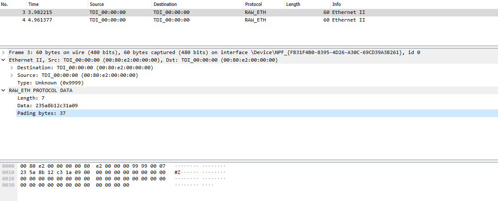

# Dekoder do WireShark

W celu łatwiejszej analizy stworzonej ramki przygotowano dekoder do oprogramowania WireShark

# Instrukcja obłsugi:
- przekopiować plik `raw_eth.lua` do folderu `C:\Program Files\Wireshark`
- otworzyć w trybie administratora plik `init.lua`
- wkleić poniższą instrukcję do ostatniej linijki pliku init:
```
dofile("raw_eth.lua")
```

Po ponownym uruchomieniu nowy dekoder powinien zostać dodany

Przy odebraniu nowej ramki ethernet o typie 0x9999 efekt powinien być następujący:
